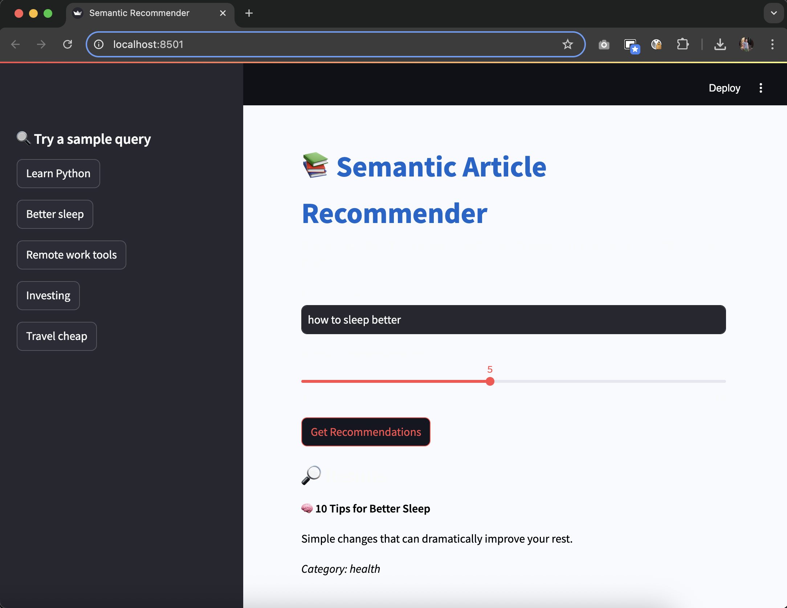

# 🔍 Semantic Article Recommender

This project is an end-to-end system that recommends **similar articles** based on **semantic similarity**, using:

- ✅ Hugging Face sentence embeddings
- ✅ FAISS vector search
- ✅ FastAPI backend
- ✅ Streamlit frontend

A hands-on project for learning and applying modern recommendation techniques powered by sentence embeddings.

---

## 📦 Features

- Generate and store vector embeddings with `sentence-transformers`
- Search for semantically similar articles using FAISS
- REST API with FastAPI (`/recommend`)
- Frontend built in Streamlit for quick interaction
- Dataset simulated for demo purposes

---

## 🧠 Technologies Used

- Python 3
- [sentence-transformers/all-MiniLM-L6-v2](https://huggingface.co/sentence-transformers/all-MiniLM-L6-v2)
- FAISS (`faiss-cpu`)
- FastAPI
- Streamlit
- Pandas

---

## 📁 Project Structure

```
semantic-recommender/
├── app/                  # FastAPI backend
│   ├── main.py
│   ├── model.py
│   └── schemas.py
├── recommender/          # Dataset + indexer
│   ├── articles.csv
│   └── build_index.py
├── index/                # FAISS vector store
│   ├── faiss_index.bin
│   └── articles.csv
├── streamlit_app/        # Streamlit UI
│   └── app.py
├── requirements.txt
└── README.md
```

---

## 🚀 How to Run

1. **Install dependencies**

```bash
pip install -r requirements.txt
```

2. **Build FAISS index**

```bash
python recommender/build_index.py
```

3. **Run FastAPI backend**

```bash
uvicorn app.main:app --reload
```

4. **Run Streamlit app (in another terminal)**

```bash
streamlit run streamlit_app/app.py
```

---

## 🔎 API Example

### `GET /recommend`

Query similar articles based on a text prompt.

**Request:**

```
GET /recommend?q=how to sleep better&k=3
```

**Response:**

```json
{
  "query": "how to sleep better",
  "results": [
    {
      "title": "10 Tips for Better Sleep",
      "description": "Simple changes that can dramatically improve your rest.",
      "category": "health"
    },
    ...
  ]
}
```

---

## 🧪 Sample Queries

Try these in the UI or via API:

- `"tips for better health"`
- `"remote work apps"`
- `"investing in 2025"`
- `"learn programming"`
- `"how to travel in Europe"`

## 🖼️ Screenshots

